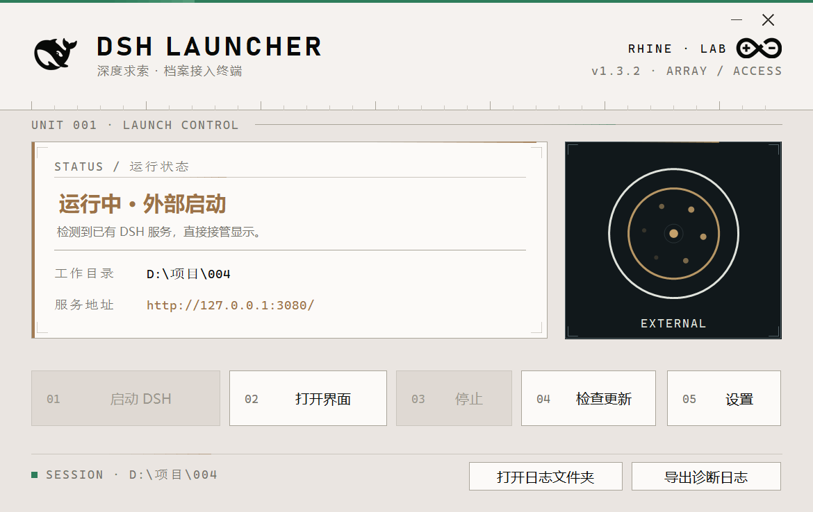
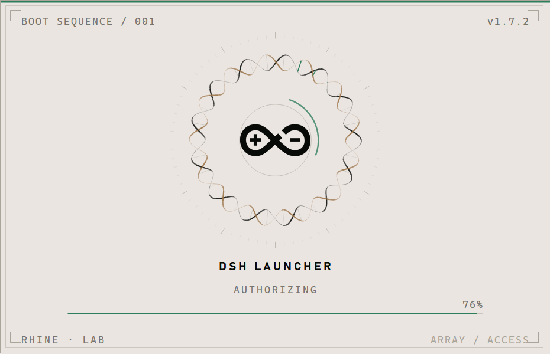
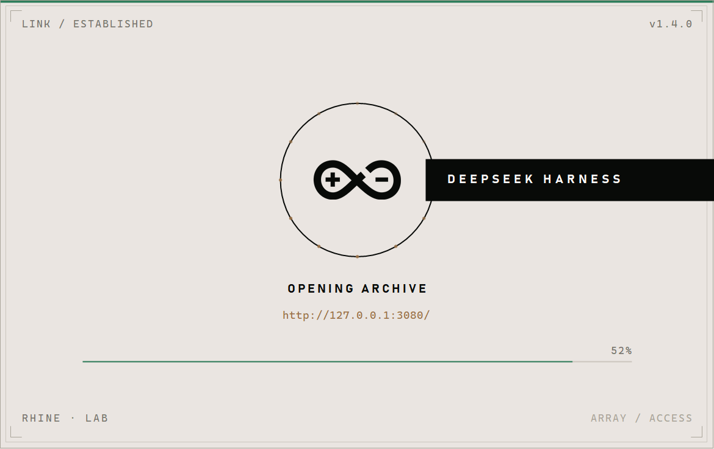
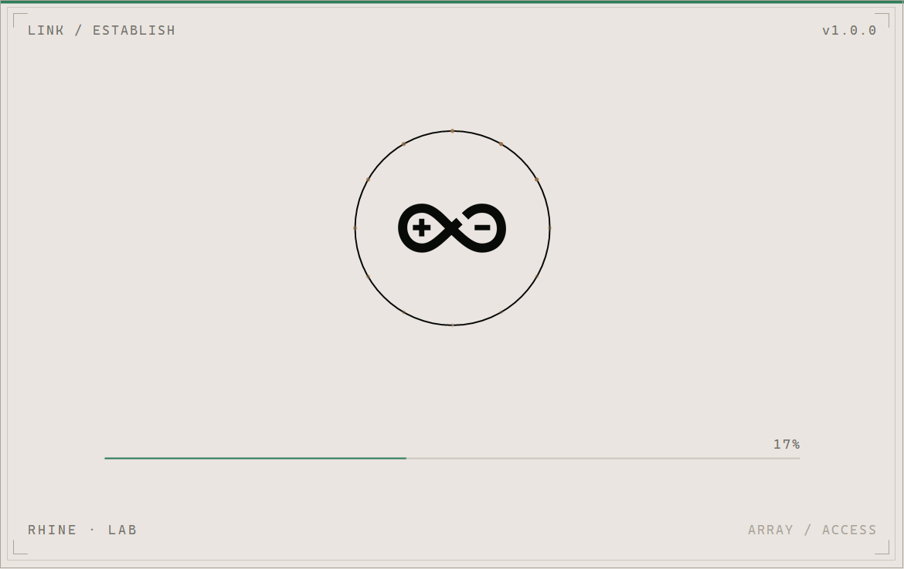
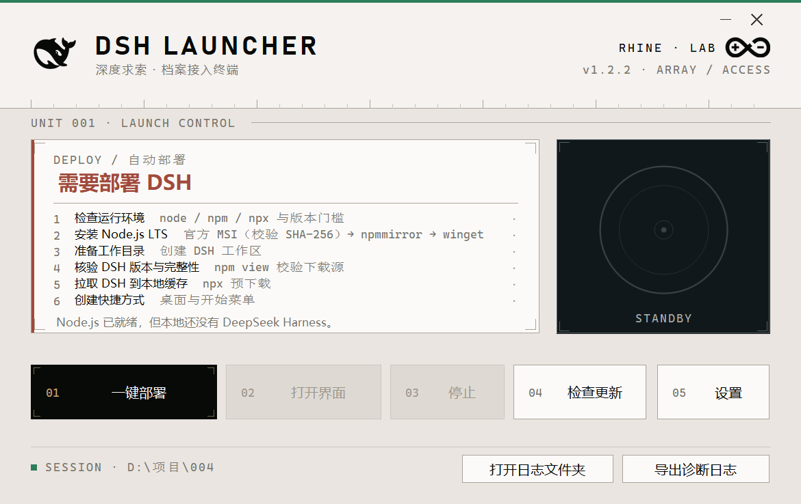
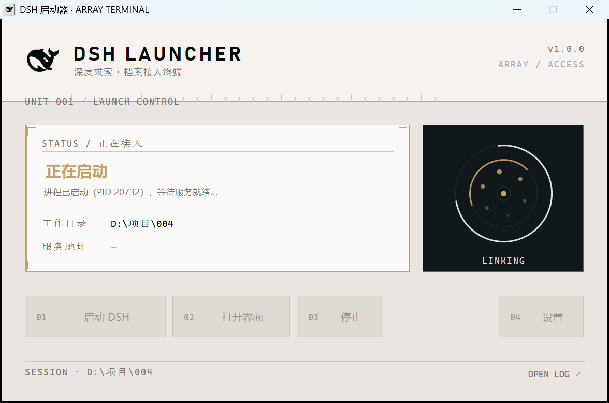
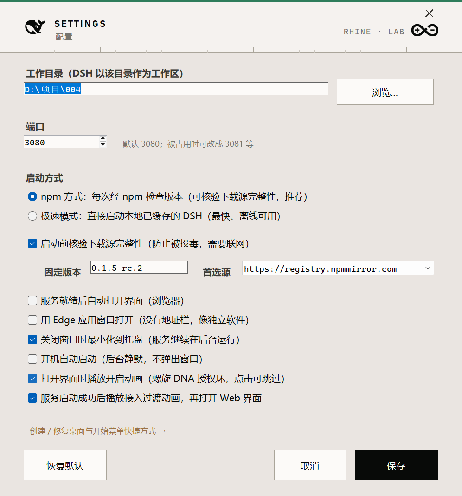

# DSH 启动器（DSH Launcher）

给 **DeepSeek Harness** 用的图形化启动器：**双击就能用，全程不会弹出任何黑色命令行窗口。**

以前的做法是双击 `.bat` → 弹出一个 Windows Terminal 窗口跑 PowerShell → 再 `npx` 下载启动，
关掉那个黑窗口服务就停了，开机自启还会闪一下黑框。这个启动器把整套流程收进一个原生小程序里：
档案终端风格界面、DSH 官方鲸鱼图标、后台静默启动、托盘常驻。

---

## 快速开始

| 怎么用 | 说明 |
| --- | --- |
| 桌面「DSH 启动器」 | 双击打开界面，点 **启动 DSH** |
| 任务栏托盘图标 | 双击 = 显示界面；右键 = 启动 / 打开界面 / 停止 / 退出 |
| 开机自启 | 已写入启动文件夹，开机后台静默拉起服务（**不弹窗、不显示界面**） |

界面上的三个主要按钮：

- **启动 DSH** —— 后台启动服务，就绪后自动打开浏览器（可在设置里关掉）
- **打开界面** —— 用默认浏览器打开 DSH 网页；状态卡片上的服务地址也能直接点
- **停止** —— 连同子进程一起结束服务（不是本启动器拉起来的服务不会被误杀）

关掉窗口只会**最小化到托盘**，服务继续在后台跑；要真正退出用托盘右键 →「退出启动器」。

## 首次运行：由你选择安装位置

启动器**不会**擅自决定把自己装到哪。第一次运行时弹一个选择框，三选一：

| 选择 | 结果 |
| --- | --- |
| **使用默认位置** | 装到 `%LOCALAPPDATA%\Programs\DSH Launcher`，并建立桌面 + 开始菜单快捷方式 |
| **自定义…** | 自己挑一个目录（例如 `D:\Apps\DSH Launcher`）；系统目录需要管理员权限 |
| **绿色免安装** | 程序就在当前所在目录运行，不往系统里装东西 |

- 用 `✕` 或 `Esc` 关掉 = **还没决定**，下次启动会再问一次 —— 不会替你选。
- 选择结果写在 `config.ini` 的 `installdir`；之后随时可以在「设置 → 安装位置」里改。
- 改安装位置时启动器会复制程序本体到新目录、重建快捷方式，然后以新位置重启自己；**正在运行的 DSH 服务不受影响**。
- 运行期数据（日志、备份）**不跟着程序走**，固定在 `%LOCALAPPDATA%\DSH Launcher\`，所以绿色包不会夹带日志，挪动程序也不会丢日志。

## 界面

视觉风格对齐 [RhineLabUI](https://github.com/LBEILC/RhineLabUI)「莱茵生命档案终端」的设计基准：
**暖灰白底 `#eae5e1`、近黑文字 `#080a08`、暖灰次要 `#77756d`、细线 `#aaa59a`、暖褐强调 `#9b7247`、暖杏金信号 `#c5a16b`**，
暗屏面板 `#11181b` / `#263136` / 分隔 `#536166`。界面以 **1 像素细线 + 宽字距紧凑排字** 组织，四角刻度、编号、`UNIT 001 / SESSION / ARRAY` 之类的技术标注。
中文用 Microsoft YaHei（站点指定的后备字体），拉丁字形用 Bahnschrift（DIN 系，近似站点的 Novecento Sans Wide），路径与数值用 Cascadia Mono。

另外按你的要求加了两样东西：

- **无边框窗口**：去掉系统标题栏后，**绿色顶边就是窗口最上沿**，右上角换成自绘的细线最小化/关闭按钮（悬停转暖褐/告警红，**按下即触发**——窗口未激活时也不会被"第一下只激活"吞掉）；整条标题栏区域按住即可拖动窗口，并用 `CS_DROPSHADOW` 补了系统投影。设置窗同款处理，并且支持 `Esc` 关闭。
- **绿色顶边框**：`#2E7D5B` 深松绿，贯穿窗口顶部整宽（设置窗同款），页脚用一颗同色小方点呼应——这个绿刻意压低了饱和度，和暖灰白、暖杏金同处一个色阶体系，不跳色。
- **莱茵生命官方标志**：路径逐字取自 RhineLabUI 的 `src/brand.ts`（`labelMarkSvg` 与 `logo` 共用同一组路径——双弧 + 左圆加号 + 右圆短横，纯 stroke 绘制），按站点要求「整个标志保持黑色」，放在标题栏右侧与 `RHINE · LAB` 组成品牌锁排。



### 开启动画（螺旋 DNA 环形加载器）

正常打开界面时会先播放一段开启动画（静默自启/自检不播放，点击或按键可跳过）：



- **主体**：双螺旋 DNA 环——两条链（近黑 `#080a08` + 暖褐 `#9b7247`）绕圆环盘绕，
  按「螺距 ≈ 2.4×螺旋直径」的 DNA 比例取 **13 圈**，振幅 ±9px，形成清晰的交织感；
  段与段按深度分 6 档透明度/线宽，前实后虚，有体积感。
- **碱基对**：环上 30 根短杠连接两条链，长度随相位自然伸缩；一道**绿色高亮波**沿环行进。
- **中心**：铺一块净空圆盘，正中是**莱茵生命官方标志**（缓出回弹缩放入场），外圈一道绿色弧缓慢反向旋转。
- **版式**：外圈刻度环、四角刻度、绿色顶边、宽字距标注，与主界面同一套语言。
- **节奏**（约 2.6 秒，可跳过）：双螺旋自 12 点方向**逐段绘制** → 标志弹入 → 旋转加载
  （`INITIALIZING → LOADING ARCHIVE → AUTHORIZING → READY`）→ 进度条走满 → 淡出到主界面。

不想要的话：设置里取消勾选「打开界面时播放开启动画」，或加 `--no-boot` 参数。

**每次启动都有动画**：启动器常驻托盘，所以"双击图标"通常命中单实例分支——第二实例只发信号就退出，原本动画根本不会播（窗口直接弹出来）。现在收到唤出信号、且窗口在托盘里时，会先播一段**精简开场**（约 1 秒，同一张卡片、时间轴压到 40%）再展开主窗口；窗口本来就开着则直接置前，不打扰。

动画流畅性与开销（实测 v1.7.1 修正）：

| 问题 | 原因 | 修法 |
| --- | --- | --- |
| 动画起手被吃掉 | `DetectExternal()` 是同步 HTTP 探测（最长 2.5 秒），且跑在 `splash.Show()` 之后、消息循环之前 | 探测移入后台线程，只把结果 marshal 回 UI |
| 收尾"鬼影卡片" | 主窗淡入用了 `p*1.35`，在卡片还剩 26% 不透明度时就已完全显示 | 改成对称交叉淡入 `p` |
| 底层窗口抢 UI 线程 | 主窗 `Opacity=0` 但 `Visible=true`，节拍器照样重绘它 | 卡片播放期间 `Anim.Suspend()`，收尾时 `Resume()` |
| 帧开销偏高 | 每帧 750+ 次 GDI+ 调用、40fps | 采样段 312→234、40→30fps、静态刻度环改缓存位图 |
| 螺旋逐段绘制太贵 | 每段一次 `DrawLine`（约 468 次/帧） | 按深度分 6 桶攒成 `GraphicsPath`，每桶一次 `DrawPath`（12 次/帧）；同桶连续段共用一条折线，接缝更圆润 |

实测开场期间单核占用 **27.6% → 22.2%（分段优化）→ 15.6%（路径批绘）**，累计降 43%；空闲约 11%；隐藏到托盘后重开，精简开场 0.77 秒后正常展开主窗。

### 自绘对话框（替代系统 MessageBox）

系统 MessageBox 是 `#32770` 系统窗口，换不了肤，而且长路径会被折成两行、也放不下复选框。所以主界面里的 23 处交互提示全部换成了自绘的 `ConfirmDialog`：

```
┌─ 绿边 ─────────────────────────────────┐
│ CONFIRM / 清扫残留                  [✕] │
│ 清扫残留 DSH 进程                       │   ← 危险操作标题转告警红
│ ────────────────────────────────────── │
│ 发现 1 个 DSH 进程族，将全部强制终止…    │
│ 进程 1   PID 21492 node.exe 端口 3080… │   ← 标签 + 等宽值，单行省略号
│                                        │
│ 正在进行的会话会被中断，未保存的工作会丢失 │   ← 告警色
│                  [ 取消 ]  [ 全部终止 ]  │   ← 危险态：红边红字，悬停转实心
└────────────────────────────────────────┘
```

- 与主界面同一套语言：绿顶边、细线卡片、**巡行彗尾**、四角刻度、宽字距标注、直角细线按钮
- 高度按内容自动计算；`Enter` = 确认、`Esc` = 取消；标题栏可拖动
- 两种形态：`ConfirmDialog.Info(...)`（只有「知道了」）与 `ConfirmDialog.Show(...)`（取消 / 确认，可选第三按钮——退出确认就是三按钮）
- **`Program.cs` 的两处保留系统 MessageBox**：启动期致命错误（那时自绘窗体不一定能起来）和 `--help` 长文本

### 强制终止与残留清扫

「停止」现在不只能停**自己拉起的**服务，也能处理**别人拉起的**（外部接管状态）：

```
点「停止」
   ↓
识别（约 0.2 秒）：端口 → PID（iphlpapi，IPv4/IPv6）→ 身份校验 → 往上找同族树根
   ↓
确认框摊开全部信息：
   监听进程：PID 28892  node.exe
   同族树根：PID 24092（含 cmd/npx 外壳）
   命令行　：…/@deepseek-ai/dsh/lib/bin.js web --port 62560 --no-open
   启动于　：09-15 20:36:52   子进程：4 个
   ⚠ 将强制终止整棵进程树；正在进行的会话会被立即中断
   ↓
从树根 taskkill /T /F → 复查（进程是否消失 + 端口是否释放）→ 状态归零
```

- **只杀确认是 DSH 的进程**：命令行含 `@deepseek-ai/dsh` / `dsh … web`，或端口返回 DSH 的 401 特征。端口被别的程序占用时**拒绝执行**并告诉你占用者是谁
- **从同族树根杀**，不是只杀监听进程——否则会留下 `cmd` / `npx` / `conhost` 外壳（实测树根识别正确：监听 PID 28892 → 树根 PID 24092）
- **权限不足**（目标以管理员运行）时会问你是否用管理员权限重试（弹 UAC）
- 杀完可选**立即重启服务**：托盘右键 →「重启服务（强制）」

**清扫残留**：主界面页脚「清扫残留」或托盘右键同名项。扫描整机所有 DSH 进程族，列出后确认再全部终止——用来清理测试留下的孤儿实例。实测能识别出完整族（`PID 21492 端口 3080 子进程 10 个`）。

> ⚠️ 注意：如果你的服务正在承载会话，强制终止会**立刻结束那个会话**。确认框里会明确警告。

### 接入过渡动画（点「打开界面」→ 动画 → 拉起 Web UI）

触发点是**「打开界面」这个动作**——按钮、状态卡片上的服务地址、托盘右键菜单，三条入口都走同一条出口：

**点击 → 播放过渡卡片 → 播完（或点击跳过）→ 才真正打开 Web UI。**

服务**首次启动成功**且勾选了「服务就绪后自动打开界面」时，同样走这条路径。



- 卡片**精确铺满主窗口客户区**（无边框后客户区=窗口矩形，像素级严丝合缝），看上去像软件自身在过渡，而不是又弹了一个窗
- 时间轴（约 1.7 秒，可点击跳过）：`LINK / ESTABLISHED` 逐字打出 → 授权环**双弧自上下闭合**、环上琥珀刻度点依次点亮、中心标志弹入
  → **黑底横条扫过**（白字 `DEEPSEEK HARNESS`，与站点开场"公司名称黑底横向扫过"同一手法）
  → `OPENING ARCHIVE` + 目标地址提示 → 进度线走满 → 绿色**冲击波**扩散 → 淡出
- **浏览器是在卡片完全播完之后才拉起**的（实测点击到打开间隔 1.72 秒），不会出现"动画还在播、网页已经抢焦点"
- 关掉这个开关、或主窗口在托盘里时，直接打开界面，不播动画



### 会动的边框（缺口沿轮廓巡行）

界面里所有「面板 + 细线框 + 刻度」的地方都做成了活的，动法取自站点原设计里标志轮廓的处理——**缺口沿轮廓移动**：

| 元素 | 动效 |
| --- | --- |
| 面板细线框 | 一道**彗尾高光沿矩形轮廓顺时针巡行**（周期 5.6s，尾部渐隐），四角刻度透明度随呼吸明暗 |
| 左侧信号条 | 透明度脉动（周期 2.6s，140↔255），颜色仍由状态决定 |
| 面板内分隔细线 | 一段高光从左往右扫过（"横向扫过"的静态化用法） |
| 状态标题 / 地址 | **文案变化时从左往右扫入**，前端带一道高光竖线 |
| 主窗口绿色顶边 | 沿边巡行的浅绿高光 |
| 章节线 / 页脚线 | 各自相位错开的扫掠高光 |
| 暗屏（授权环）面板 | 同款巡行彗尾，换成暗色系配色 |

所有动效共用一条时间轴（`Anim` 全局时钟 + 单个 33ms 节拍器），各处同相位、不会各动各的。

**性能**：自适应帧率——忙时（接入中/异常/部署中）跑 30fps，空闲降到 ~10fps；主窗口只重绘三条会动的窄带而不是整窗；控件不可见（在托盘里）时完全不重绘。实测空闲单核占用约 **9.4%**，隐藏到托盘后≈0。

### 没部署过？启动器自动接管

给没装过 DSH 的人用：启动后先自动体检，**没部署过就直接进入自动部署向导**，不用碰命令行。

体检项（判定标准对齐安装脚本的 `Test-NodeReady`）：

- 系统是否为 **Windows 10/11 的 64 位**（对齐安装脚本的 `Test-WindowsCompatibility`）
- `node` / `npm` / `npx` 是否齐全，且 **Node 版本 ≥ 22.19 或 ≥ 24**
- 本地是否已有 DSH（npx 缓存或全局安装）
- 工作目录是否存在
- 固定版本模式下，本地缓存的那份是否就是 `pinnedversion`

一切正常 → 什么都不做，界面照旧。缺东西 → 先播一段「**进入部署**」过渡卡片（`DEPLOY / REQUIRED` → `AUTO DEPLOYMENT`，与接入过渡同一版式），然后面板切成部署清单：



点「一键部署」，按旧安装脚本的顺序执行七步：

| # | 步骤 | 说明 |
| --- | --- | --- |
| 1 | 检查系统兼容性 | Windows 10/11 的 64 位系统（用 `RtlGetVersion` 读真实版本，不依赖进程清单） |
| 2 | 检查运行环境 | node / npm / npx 与版本门槛 |
| 3 | 安装 Node.js LTS | **官方 MSI（下 `SHASUMS256.txt` 校验 SHA-256）→ npmmirror 镜像 → winget** 三级降级；镜像这一级的校验值优先取镜像自己那份（实测与官方逐字节一致）。每级都可能弹 UAC |
| 4 | 解析版本与完整性 | 先翻官方 GitHub Release，只认「非 draft + tag 形如 `dsh-v<semver>` + immutable」的版本，再确认 npm 上确实有；都不行才退回「npm 已发布版本里最大的」。解析结果会写回配置，避免"部署装最新、启动用旧 pin" |
| 5 | 准备工作目录 | 不存在则创建 |
| 6 | 拉取 DSH 到本地缓存 | `npx -y @deepseek-ai/dsh@<版本> --version`；**拉取期间每秒显示 npm 缓存增量与近似写入速度**（旧脚本同款，不编造百分比），结束后还要校验缓存里真的有一份可用的 DSH |
| 7 | 创建快捷方式 | 桌面 + 开始菜单；失败会如实报失败，不再"失败也算完成" |

清单每行右侧有状态标记（`·` 待执行 / `>` 进行中 / `OK` 完成 / `!!` 失败 / `--` 跳过），底部一行显示当前动作或结论。
部署完成后自动切回普通界面并启动服务（走接入过渡动画）。Node 三级渠道都失败时会打开 nodejs.org 并给出提示。

网络取数**优先交给 node**（自带 OpenSSL，不受 Windows 证书栈抽风影响），node 不可用时才退回 .NET；下载安装包时 .NET 失败也会用 node 重试一遍。

版本策略由 `config.ini` 的 `versionmode` 决定：`latest`（默认）＝每次解析官方最新可安装版；`pinned`＝固定用 `pinnedversion` + `pinnedintegrity`。设置里也能切换。

> 排障/演示：设置环境变量 `DSH_LAUNCHER_FORCE_DEPLOY=1` 可强制走一遍部署向导（已装好的机器上会跳过安装、快速跑完）。

### 动画之间的衔接

三段动画（开场 → 主界面 → 接入过渡）共用同一套外框、缓动曲线与时间基准，接缝处不留硬切：

- **开场 → 主界面**：主窗口先以全透明就位，动画最后 0.55 秒里卡片**边界插值到主窗口边界**、自身淡出，同时主窗口淡入——是"展开"而不是"切走"。
- **主界面 → 接入过渡**：过渡卡片精确铺满主窗口客户区，出现时 0.18 秒淡入，看不出是另一个窗口。
- **状态切换**：右侧授权环的弧长现在是**平滑插值**的（`268° ⇄ 360°` 缓缓收合/补全），状态变化时不会"跳"一下；环的收拢入场也只播一次，不再随状态切换重播。
- 所有缓动统一收在 `Theme.EaseOutCubic / EaseInOutCubic / EaseOutBack / Phase`，避免各段动画各用各的节奏。
- **卸载面板的「清单 → 加载」变形**用的是同一族缓动与同一道彗尾手法（见下文「执行中：清单变形成加载动画」），所以即使跨窗口，观感也是一套语言。

> ⚠️ 实现上有个坑记在这里：**不能用 `Application.Run(splash)` 再 `Application.Run(ctx)`**。
> 前一个消息循环结束时 `ExitThread` 会关掉该线程上的**所有**窗口（连主窗口一起没）。
> 现在开场动画是**非模态窗口**，由主消息循环统一驱动。

### 版本检测与一键更新

启动时自动检查是否有新版本（读 `version.txt` 构建出来的产物版本号），结果显示在三处：

- 标题栏右侧：`v1.1.4`，有更新时变成 `v1.1.3 › v1.1.4` 并转暖褐
- 主按钮行的 **检查更新** 按钮：无更新时是「检查更新」，有更新时变成「更新 1.1.4」并转强调色
- 日志：`发现新版本 v1.1.4（本地构建于 …）`

点按钮 → 确认 → **更新并重启启动器**（正在运行的 DSH 服务不受影响）：

- 运行中的 exe 允许改名，所以流程是：把当前 exe 改名为 `.old` → 把新版本复制到原路径 → 以 `--after-update` 启动新实例 → 当前实例退出释放单实例锁
- 新实例会等旧实例交出单实例锁（最多 15 秒）再启动，避免被单实例挡掉
- `.old` 文件在下次启动时自动清理

版本号写在 `version.txt`；`build.ps1` 会把它写进 exe 的文件版本供比对，同时生成 `src/BuildInfo.Generated.cs`。

### 导出诊断日志

页脚右侧「导出诊断日志」按钮：把排查问题需要的信息打包成一个 txt 放到桌面并自动选中。

内容：运行环境（系统 / CLR / 缩放 / 显示器）、DSH 服务状态（工作目录、端口、启动方式、核验开关、端口探测结果、node/npx/DSH 缓存入口、DSH_HOME）、更新检查结果、完整配置、最近两天的启动器日志（当天全量 + 前一天尾部）。
旁边还有「打开日志文件夹」直接定位日志目录。

### 圆形加载器（授权环）

界面右侧是一块**暗色屏幕**，里面是照着设计基准实现的加载动画：
原文描述为「**从画面外收拢的黑白双环、反向内弧、橙色节点**」——
启动时白色外弧顺时针旋转、琥珀内弧**反向**旋转并周期性减速（呼吸感），
**六颗琥珀节点**沿轨道依次亮起，中央圆点闪变；环在进入状态时会从画面外**收拢**就位。
屏幕下方的状态词随状态切换：`STANDBY / LINKING / LINKED / EXTERNAL / FAULT / PORT BUSY`。



### 运行日志已从界面移除

主界面不再有日志区，取而代之的是状态面板里的**实时进度副标题**（例如「正在核对下载源完整性…」「进程已启动（PID 20732），等待服务就绪…」）。
完整日志仍然写文件，点右下角 `OPEN LOG ↗` 直接定位：`%LOCALAPPDATA%\DSH Launcher\logs\`



---

## 它到底做了什么（和旧方式对比）

| | 旧方式（.bat + PowerShell） | 本启动器 |
| --- | --- | --- |
| 启动时的窗口 | Windows Terminal 黑窗，一直开着 | **没有窗口**（`CREATE_NO_WINDOW`） |
| 关掉窗口 | 服务跟着停 | 服务继续跑，托盘可控制 |
| 开机自启 | `powershell.exe -WindowStyle Minimized`，会闪黑框 | 静默启动，只进托盘 |
| 启动过程可见性 | 要盯着命令行看有没有起来 | 状态灯 + 中文日志，就绪后自动开界面 |
| 停止服务 | 关窗口 / 手动 taskkill | 一键停止（整棵进程树） |

技术要点：启动器是 **.NET Framework 4.8 的原生 WinForms 程序**（单文件 exe 约 290 KB，含内嵌图标，无第三方依赖，Win10/11 自带运行时），
用 `UseShellExecute=false` + `CreateNoWindow=true` 拉起 node，
子进程继承的是**没有窗口的隐藏控制台**，所以 DSH 后续调用命令行工具（pwsh 等）也不会冒窗。

---

## 设置项（界面里点「设置」）

| 项目 | 说明 |
| --- | --- |
| **工作目录** | DSH 以该目录作为工作区，默认 `D:\项目\004` |
| **安装位置** | 程序本体放在哪里。**首次运行由你自己选**（默认位置 / 自定义 / 绿色免安装），之后可随时在设置里改 |
| **端口** | 默认 `3080` |
| **npm 方式** | 每次经 npm 启动 `@deepseek-ai/dsh@<当前版本>`，可开启下载源完整性核验（推荐，沿用原有安全策略） |
| **始终用官方最新版** | 勾选（默认）：部署时解析官方最新可安装版并写回配置；取消则固定用「固定版本」里那个版本号 |
| **极速模式** | 跳过 npm，直接启动本地已缓存的 DSH，最快且离线可用 |
| **自动打开界面** | 服务就绪后自动用浏览器打开 |
| **Edge 应用窗口** | 用 Edge 的 `--app` 模式打开，没有地址栏，像独立软件 |
| **关闭窗口时最小化到托盘** | 取消勾选则关闭窗口 = 退出启动器 |
| **开机自动启动** | 写入/删除启动文件夹里的自启快捷方式 |

配置文件（可直接用记事本改）：`%APPDATA%\DSH Launcher\config.ini`

---

## 日志与排查

- 启动器日志：`%LOCALAPPDATA%\DSH Launcher\logs\launcher-YYYYMMDD.log`
- 界面里点右上角「打开日志文件夹」可直接定位
- 服务自身的输出（npm 警告、DSH 启动信息）也会一并记录在这个日志里

常见情况：

- **端口被占用** → 设置里换端口（例如 3081）
- **检测到"运行中（外部启动）"** → 说明服务是别的方式拉起来的，启动器只负责显示和打开界面，不会去杀它
- **下载源完整性核验失败** → 网络问题，或改成极速模式 / 在设置里关掉核验
- **快捷方式点不开 / 开机没自启** → 多半是安装目录被删过或挪过。设置里点「创建 / 修复快捷方式」一次修好三处（桌面 + 开始菜单 + 开机自启）；启动器每次启动也会核对，把失效快捷方式和孤儿自启项写进日志
- **想换安装位置** → 设置 →「安装位置 → 更改…」，保存后自动把程序本体搬过去并重启（DSH 服务不受影响）
- **更新检查一直失败** → 先看日志末尾那句：网络 TLS 失败属于系统级 Schannel 问题（与启动器无关，可用 `curl -sS https://api.github.com/` 复核）；若是 404，则说明仓库是 Private，匿名 API 取不到 Release

---

## 自检：验证"真的没有黑窗"

```powershell
& "$env:LOCALAPPDATA\Programs\DSH Launcher\DSH Launcher.exe" --selftest "$env:TEMP\report.txt"
```

它会在**临时目录 + 随机空闲端口**上真实启动一次服务，并：

1. 记录启动前可见的控制台窗口数量
2. 启动服务并等待就绪
3. 对比启动后是否**新增**了可见的控制台窗口（期望 0）
4. 用 node 拉起一个 powershell（模拟 DSH 调用命令行工具），再次检查是否冒窗
5. 停止服务，确认端口释放

末尾给出 `结论：PASS / FAIL`，退出码 0/1。

---

## 命令行参数

```
DSH Launcher.exe                 打开启动器界面
DSH Launcher.exe --autostart     后台静默启动服务（供开机自启使用，不弹窗）
DSH Launcher.exe --minimized     只放进系统托盘，不显示窗口
DSH Launcher.exe --settings      打开界面并直接进入设置
DSH Launcher.exe --port 3080     临时指定端口（不写回配置）
DSH Launcher.exe --dir D:\项目   临时指定工作目录（不写回配置）
DSH Launcher.exe --after-update  更新后重启（先等旧实例交出单实例锁）
DSH Launcher.exe --after-install 迁移安装位置后重启（同上）
DSH Launcher.exe --selftest 报告.txt [--mode direct|npx] [--verify] [--port 3099]
DSH Launcher.exe --help          用法说明
```

---

## 从源码构建

```powershell
powershell -File build.ps1            # 编译 + 安装 + 创建快捷方式
powershell -File build.ps1 -Icons     # 顺便重新生成图标（需要 sharp）
powershell -File build.ps1 -SelfTest  # 编译后自动跑无黑窗自检
```

> 脚本是 UTF-8 with BOM 保存的：Windows PowerShell 5.1 读无 BOM 的 .ps1 会按 GBK 解析导致中文乱码，改动时请保持 BOM。

目录结构：

```
dsh-launcher/
├─ src/                  C# 源码（.NET Framework 4.8 / C# 5，无需 SDK）
│  ├─ Program.cs         入口、单实例、DPI
│  ├─ LauncherContext.cs 托盘 + 窗口 + 服务的协调
│  ├─ LauncherForm.cs    主界面（档案终端版式 + 自绘标尺与细线）
│  ├─ ConfirmDialog.cs   自绘确认/提示对话框（替代系统 MessageBox）
│  ├─ ProcessKiller.cs   端口→PID 识别、同族树根、taskkill 强杀 / 清扫残留
│  ├─ Anim.cs           全局动效时钟（统一时间轴 + 单个节拍器 + 分区重绘）
│  ├─ Deployment.cs     部署检测 + 自动部署引擎（Node 三级安装链 / 源核验 / 预下载）
│  ├─ DeployPanel.cs     部署清单面板
│  ├─ UpdateCheck.cs     版本检测与自更新
│  ├─ Diagnostics.cs     诊断日志导出
│  ├─ BootSplash.cs      开启动画（螺旋 DNA 环形加载器 + 中心标志）
│  ├─ LinkTransition.cs  接入过渡动画（服务就绪 → 交接 Web UI）
│  ├─ RingIndicator.cs   圆形加载器（黑白双环 / 反向内弧 / 琥珀节点）
│  ├─ StatusPanel.cs     状态面板（细线方框 + 四角刻度 + 信号条）
│  ├─ FlatButton.cs      直角细线按钮
│  ├─ SettingsForm.cs    设置窗口
│  ├─ DshServer.cs       服务启动/就绪探测/停止、node/npx 定位
│  ├─ AppConfig.cs       config.ini 读写
│  ├─ InstallLocation.cs 安装位置：首次由用户选择 / 复制本体 / 重建快捷方式
│  ├─ DeployExtras.cs    部署扩展：系统门 / node 优先取数 / 版本解析 / npm 缓存探针
│  ├─ Uninstaller.cs     卸载引擎：按内容识别目标 / 生成计划 / 回收站删除 / 硬护栏 / 报告（带进度回调）
│  ├─ UninstallForm.cs   卸载二级界面（独立窗口 + 明细列表 / 加载动画「变形」+ 选项区）
│  ├─ TypeConfirm.cs     危险操作的打字确认框（涉及凭据/配置时强制手打确认词）
│  ├─ Shortcuts.cs       .lnk 创建（WScript.Shell 后期绑定）
│  ├─ WindowProbe.cs     可见控制台窗口枚举（自检用）
│  ├─ SelfTest.cs        自检流程
│  ├─ FileLog.cs         日志与路径
│  ├─ Theme.cs           配色/DPI/字体/宽字距排字与细线绘制
│  └─ Resources.cs       内嵌图标资源
├─ assets/               app.ico（多尺寸）、logo.png、rhinelab-mark.png（官方标志）
├─ tools/make-icon.cjs   官方 favicon.svg → 档案终端配色图标
├─ docs/                 界面截图
├─ app.manifest          DPI 感知 + 管理员权限 asInvoker
└─ build.ps1             构建/安装脚本
```

图标用的是 **DSH 官方图标**（`@deepseek-ai/dsh-web-frontend/dist/favicon.svg` 里的鲸鱼），
按档案终端的配色重新上色：暖白底 + 细黑框 + 近黑鲸鱼 + 一颗暖杏金信号点。

---

## 卸载

主界面按 **卸载…**（托盘右键同名项、设置窗右下角「卸载 DSH / 启动器…」也是同一入口）打开**卸载二级界面**——一个独立的档案终端风格窗口，先把"要删什么"摊开给你看，再动手。

> 主按钮行是 5 个**不带编号**的按钮：**启动 DSH**（主操作，宽 168）/ 打开界面 / 停止 / 检查更新 / 卸载…，
> 其余等宽 124、间距 14 —— 原来带 `01/02/03` 编号时左侧被占 42px，「卸载…」会被省略号吃掉。
> **设置搬到了右上角**：品牌锁排左边那颗**齿轮**，右边紧跟**「设置」二字**（暗灰，鼠标移上去齿轮与文字一起转暖褐）。
> **齿轮和「设置」二字都可以点**，两处同一个出口。
> **v2.0 起齿轮左边又加了「? 帮助」**（同样是图标 + 文字、两处都可点）。锁排整体是
> `? 帮助 │ ⚙ 设置 │ RHINE · LAB │ 莱茵生命标志`。

## 帮助（二级 + 三级界面）

右上角 **? 帮助**（托盘右键「帮助…」同一个人口）打开**帮助二级界面**：左边是主题目录（按「入门 / 界面 / 日常 / 进阶」分四组，共 **15 个主题**），
右边是选中主题的概览（标题 + 一句话摘要 + 要点）。点「打开详细说明」（或双击/回车）进**三级界面**看完整正文。

三级界面把每个主题写成**段落 / 编号步骤 / 键值表 / 提示 / 警告 / 命令行底衬**六种内容块，可滚动；
左侧仍是那套「章节导轨 + 圆点 + 引线」，圆点落在每个小节标题上。底部有「上一主题 / 下一主题 / 返回目录」，键盘也支持 `← →` 与 `Esc`。

覆盖的内容（**66 个内容块、约 7700 字**）：

| 分组 | 主题 |
| --- | --- |
| 入门 | 快速上手 · 一键部署的 7 个步骤 · 启动方式（npx/极速） · 版本策略（latest/pinned） · 安装位置 |
| 界面 | 界面与动效（含三档过渡动画） · 状态面板与授权环 |
| 日常 | 托盘与开机自启 · 三处快捷方式与修复 · 检查更新与自动更新 · 卸载（五种范围与硬护栏） |
| 进阶 | 命令行参数（全表） · 自检与诊断日志 · 排障常见问题（6 小节） · 关于本启动器 |

内容全部写在 `src/HelpTopics.cs` + `src/HelpTopicsMore.cs` 里，**纯数据**：加主题、加小节都不用碰界面代码。


### 二级界面的过渡动画（版式逐笔就位）

四个二级界面（设置窗 / 卸载窗 / 确认框 / 打字确认框）打开时都有过渡。它**不是**"盖住内容再揭开"，
而是**静态版式在 600ms 内逐笔就位** —— 内容从第一帧就能读，动画只是在画括号、标签块和引线。
这个思路来自《莱茵生命 PPT 模板》：那份模板全场用 PowerPoint 的**「平滑」(Morph)** 转场，元素位移就位、不遮挡内容。

设计元素全部取自那份模板与 [LBEILC/RhineLabUI](https://github.com/LBEILC/RhineLabUI)：

| 元素 | 出处 | 在这里怎么用 |
| --- | --- | --- |
| **四角括号**（1px L 形，臂长 14） | 模板的 `⌐` 角标 | 框住整张卡片：0/30/60/90ms 起笔，每支 70ms，左上先动 |
| **黑色标签块 chip + 白色大写字距小字** | 模板的 `SERVICES SECT.` | 每个章节：`SECT. 01` … ，块自左向右刷入 |
| **章节导轨 + 圆点 + 短引线** | 模板的 leader line + dot | 左侧 1px 竖线自上而下画，每落一节圆点 + 引线，**明确指向它标的是哪一节** |
| **浅色高亮条 + 右端小圈** | 模板的 `RHINE LAB.LLC.` | 标题 `SETTINGS` / `UNINSTALL` 背后先刷出条，文字再自左向右**擦入**（不用打字机） |
| **极淡方格** | 模板的"网格透明图" | 间距 44px、1px、alpha 16 —— 是**纸质**不是图案 |
| **刻度尺** | 启动器既有语言 | 27 根按 11ms 错峰点亮 |

| 相位 | 时间 | 做什么 |
| --- | --- | --- |
| 淡入 + 微升 | 0–100ms | `Opacity` 0→1，窗口自 **+6px** 升到位（不再用 12px 大位移） |
| 四角括号 | 0–300ms | 四支依次起笔 |
| 极淡网格 | 60–260ms | 自上而下浮现 |
| 高亮条 → 标题 | 60–300ms | 条先到位，文字随后擦入 |
| 章节导轨 | 180–560ms | 导轨下画，每节圆点 + 引线 + `chip + 中文 + 灰色英文` 依次落下（每节 +60ms） |

大窗全程 **600ms**，对话框按原库的 **300/200ms**（它没有章节，只做括号 + 标签块 + 标题擦入）。
两者都可**点击或按键跳过**。三条规矩照做：**可打断续算**、**退场比入场短**、**「减少动态效果」是硬分支而不是"把动画调快"**。

- 缓动 / 时长 / 相位表收在 `src/UiMotion.cs`，版式画法收在 `src/UiPaint.cs`，时序驱动是 `src/WindowReveal.cs`
- 章节锚点在 `BuildUi` 里用 `AddSection(...)` 登记，标题由 `OnPaint` 自绘（不再是子控件 Label，那样没法跟着导轨显形）

**档位**：设置里「二级界面过渡动画」三档 —— **完整**（默认，600ms 全部版式）/ **精简**（只留 150ms 整窗淡入）/
**关闭**（瞬时到位，等同 reduced-motion 硬分支）。写进 `config.ini` 的 `motion=full|brief|off`，改动**从下一个二级界面开始生效**。

> ⚠️ 两个**实测踩出来**的坑，注释都留在代码里：
> ① **模态窗「取消关闭」会把 `DialogResult` 重置成 `Cancel`** —— 退场动画靠 `e.Cancel` 推迟关闭，
> 不先把返回值记下来、关之前再写回去，「保存设置」会**静默变成取消**。
> ② **对话框与大窗必须是两条时间轴**（300ms vs 600ms）。曾经让对话框套用大窗的 600ms，于是
> 「入场期间按 Esc 先跳过动画」这条保护把 Esc 吃掉、而驱动它的定时器早已停掉 —— **窗口再也关不掉**，
> 回归用例 `DeployProbe.exe dialog-close` 直接挂死。现在对话框的跳过**不吞按键**。

### 按钮的动效### 按钮的动效

所有按钮共用全局时钟 `Anim`，与窗体上的扫掠/彗尾同相位：

| 时机 | 效果 |
| --- | --- |
| **悬停** | 一道**彗尾横扫按钮面**（中间亮、两端渐隐，1.9 秒一轮）+ **四角刻度浮现** |
| **主按钮（启动 DSH）** | 四角刻度 **3.4 秒缓慢呼吸**（与状态面板左侧信号条同一手法） |
| **按下** | 边框**内收 1px**，做出"压下去"的收紧感（不做位移，免得整行跳动） |
| **空闲** | 只有主按钮登记 10fps 做呼吸；其余按钮**不悬停就完全不重绘** |

> 取色有个坑：危险态（停止）与强调态的**悬停填充本身就是红/琥珀色**，彗尾再用同色扫过去等于没扫 —— 这两种改用浅色 `PanelHi`。

### 执行中：清单「变形」成加载动画

点下「执行卸载」并通过确认之后，中间那块「将执行的操作」**不换窗口、直接在原地变成加载动画**（0.72 秒，`UninstallList.MorphSeconds`）：

| 进度 | 画面 |
| --- | --- |
| `0.00 → 0.45` | 明细行**上移 24px 并淡出**（`Theme.EaseInCubic`） |
| `0.42 → 0.72` | 加载环在同一矩形里**淡入**（`Theme.EaseOutCubic`） |
| `0.62 → 1.00` | 面板上的文字跟着淡入（`TextRenderer` 不吃 alpha，所以是**面板底色→目标色插值**出来的"淡"） |
| 全程 | 接缝处一道**彗尾横扫面板**（与按钮悬停同一手法），细线框从空闲态的 5.6 秒巡行换成执行态的 3.4 秒暖褐巡行 |

加载动画是右侧「授权环」那套语言的小尺寸版，**进度分母是真实项数，不编造百分比**：

- 外圈细环 + 按项数走的**进度弧**（`Done / Total` 显示在右上角）
- 两条**反向旋转**的内弧（3.2 秒 / 2.3 秒）
- **六颗琥珀节点依次点亮**（2.4 秒一轮）+ 中心点呼吸（2.2 秒）
- 环下面三行：当前路径（等宽字体、中间省略）／`已删除 1.42 GB / 1.95 GB · 02:37`／当前项的名字
- 左上角常驻 `UNINSTALLING`

> ⚠️ 删除**跑在后台线程上**（STA，`dsh-uninstall`），进度用 `BeginInvoke` 回主线程。
> 以前是同步跑：删 1.95 GB / 11 万个文件期间窗口整个冻住，连动画都播不出来。
> 另外，范围③这种几百毫秒就删完的小方案，结果框会**等过渡播完**再弹（按 `MorphLeft()` 定时），
> 否则会看到"过渡走到一半突然跳回清单"的抽帧。执行期间关窗口会**问一次**：中断会留下半卸载状态。

想自己看这几帧：`DeployProbe.exe uninstall-anim <输出png>`（见 `build/uninstall-anim.png` 与 `-timeline.png`）。

想验证"后台执行 + 进度回主线程 + 界面不冻结"：`DeployProbe.exe uninstall-async <输出png>`。
它往计划里塞 3000 个**不存在**的假路径，`Execute` 会真跑一遍完整循环（6000 次进度回调）、
同时开一个真消息循环数定时器消息，最后核对 `Done` 是否单调、工作线程有没有直接碰 UI —— **全程零删除**。

### 五种卸载范围

| 范围 | 删什么 | 确认方式 |
| --- | --- | --- |
| **① 卸载 DSH（保留用户数据）** | 只删 DSH 程序包（npx 缓存里按内容识别出的那些） | 普通危险确认 |
| **② 彻底卸载 DSH（连同所有相关文件）** | ① + `.dsh`（含 `.credentials.yaml` 与全部会话）+ 壁纸引擎数据 + 插件记忆数据 | **打字确认：`UNINSTALL DSH`** |
| **③ 卸载启动器（保留配置与日志）** | 启动器本体 + 三处快捷方式 | 普通危险确认 |
| **④ 彻底卸载启动器（连同所有相关文件）** | ③ + 配置 + 日志 + 早期安装残留 + 桌面旧文件 | **打字确认：`UNINSTALL LAUNCHER`** |
| **⑤ 彻底卸载全部（DSH + 启动器）** | ② + ④ | **打字确认：`UNINSTALL ALL`** |

勾了**永久删除**（不送回收站）时，会在上面那道之外**再叠一层**打字确认：`DELETE`。

### 自动化的安全措施

- **默认送回收站**，可还原；永久删除必须显式勾选 + 打字确认
- **执行前先停 DSH 服务**（数据目录被占用时删不干净）
- **卸载前把凭据与配置备份到桌面**（`.credentials.yaml` + `config.ini` + 用量台账，几百字节）
- **明细实时列出三类**：将删除 / 将保留 / **不会动**
- **卸载报告写到桌面**，完成后自动用资源管理器定位它，并给一个「打开任务管理器」按钮便于核对残留进程
- 每项删除逐条打勾，失败的如实报出来（含被占用文件名）

### 永远不会动的东西（硬护栏）

卸载引擎只处理它自己识别出来的白名单路径，并且：

- **不碰你的工作区**（`D:\项目\004` 那 700 多 MB 工程文件）
- **不碰非 DSH 的 npx 缓存**——实测本机 `_npx` 下 4 个目录里只有 2 个是 DSH，另外两个共 489 MB 是别的包
- **不碰 `%APPDATA%\npm`**（那里是 claude-code / pnpm 等，与 DSH 无关）
- **不卸载 Node.js**——除非它确实装在我们部署时会用的位置；自装的 Node（如 `D:\AI\Node`）只会被列出来并注明"不会动"

这三条会直接显示在界面上（标 `··` 不动的那些行），让人看得见"我不会乱删"。

### 附：手动卸载（不想用界面时）

1. 托盘右键 →「退出启动器」
2. 删除安装位置目录（默认 `%LOCALAPPDATA%\Programs\DSH Launcher`；绿色版就是你放 exe 的那个目录）
3. 删除 `%APPDATA%\DSH Launcher`（config.ini）与 `%LOCALAPPDATA%\DSH Launcher`（日志、备份）
4. 删除桌面、开始菜单、启动文件夹里的「DSH 启动器」快捷方式
5. 如果要连 DSH 一起清：删 `%USERPROFILE%\.dsh`、`%USERPROFILE%\.dsh-wallpaper-engine`，以及 `_npx` 下**含 `@deepseek-ai/dsh` 的那几个**缓存目录（别整目录删）

> 旧的 PowerShell 方案残留（`桌面\2026-08-29_install-and-run-deepseek-harness.bat`、`Uninstall_DSH_Desktop.exe`、启动文件夹里的 `DeepSeekHarness-AutoStart.lnk.bak`）也在 ④/⑤ 的清理范围里，可以按需取消勾选。
